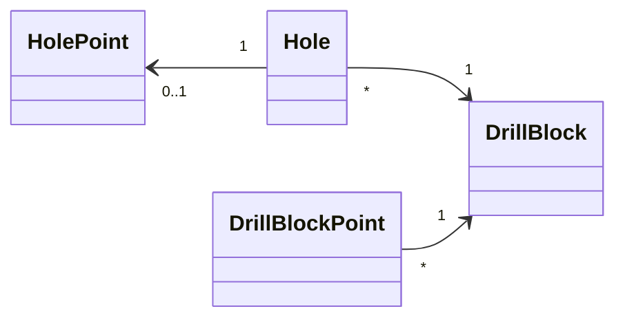
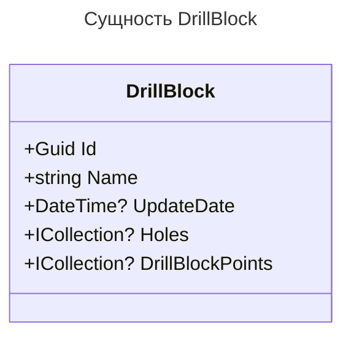
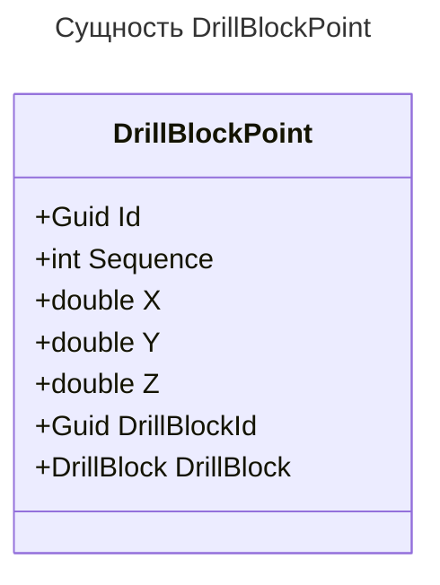
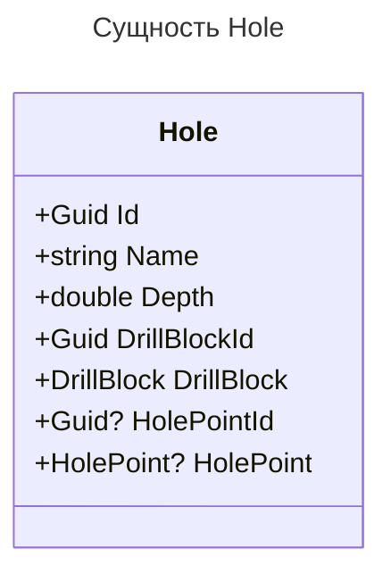
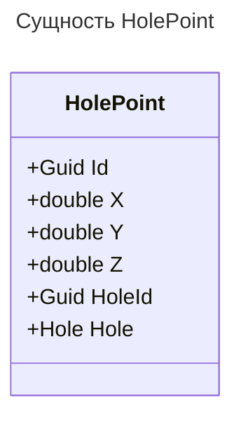

# Проект "DrillingExplorer REST API"

Проект "DrillingExplorer" - представляет собой веб-службу REST API, разработанную на платформе ASP.NET Core.
Предоставляет функциональность для работы с данными о блоках обуривания, скважинах и соответствующих точках.

## Технологии

В реализации будут использоваться следующие технологии / сборки / фреймворки / подходы / паттерны.

- **C#**
- **ASP.NET Core**
- **PostgreSQL**
- **Entity Framework Core**
- **Clean Architecture**
- **CQRS**
- **MediatR**
- **AutoMapper**
- **FluentValidation**
- **Swashbuckle**
- **xUnit**

## Функциональность, правила, бизнес логика

## Сущность "DrillBlock"

- [x] `Name` не должно быть пустым.
- [x] API должна содержать методы CRUD для управления сущностью `DrillBlock`:
  - [x] `GetAll()`
  - [x] `Get(Guid id)`
  - [x] `Create(CreateDrillBlockDto createDrillBlockDto)`
  - [x] `Update(UpdateDrillBlockDto updateDrillBlockDto)`
  - [x] `Delete(Guid id)`

## Сущность "DrillBlockPoint"

- [x] `DrillBlockId` обязательно при создании новой точки.
- [x] `Sequence` должна быть определена автоматически и увеличиваться на единицу относительно предыдущих точек.
- [x] При удалении точки необходимо обновить последовательность.
- [x] API должна содержать методы CRUD для управления сущностью `DrillBlockPoint`:
  - [x] `GetDrillBlockPoints(Guid drillBlockId)`
  - [x] `GetDrillBlockPoint(Guid drillBlockId, Guid pointId)`
  - [x] `CreateDrillBlockPoint(Guid drillBlockId, CreateDrillBlockPointDto createDrillBlockPointDto)`
  - [x] `UpdateDrillBlockPoint(UpdateDrillBlockPointDto updateDrillBlockPointDto)`
  - [x] `DeleteDrillBlockPoint(Guid drillBlockId, Guid pointId)`

## Сущность "Hole"

- [x] `Name` не должно быть пустым.
- [x] `DrillBlockId` обязательно при создании новой скважины.
- [x] API должна содержать методы CRUD для управления сущностью `Hole`:
  - [x] `GetAll()`
  - [x] `Get(Guid id)`
  - [x] `Create(CreateHoleDto сreateHoleDto)`
  - [x] `Update(UpdateHoleDto updateHoleDto)`
  - [x] `Delete(Guid id)`

## Сущность "HolePoint"

- [x] `Name` не должно быть пустым.
- [x] `DrillBlockId` обязательно при создании новой скважины.
- [x] API должна содержать методы CRUD для управления сущностью `HolePoint`:
  - [x] `GetHolePoint(Guid id)`
  - [x] `CreateHolePoint(Guid holeId, CreateHolePointDto сreateHolePointDto)`
  - [x] `UpdateHolePoint(UpdateHolePointDto updateHolePointDto)`
  - [x] `DeleteHolePoint(Guid holeId)`

## Диаграмма классов

## Документация API

После запуска проекта, документация API будет доступна по адресу `https://localhost:<port>/swagger`.

## Авторы

    Даниил Владимирович - mr.danil.zverev@mail.ru

Свяжитесь со мной по указанному адресу электронной почты для обратной связи или дополнительной информации.
